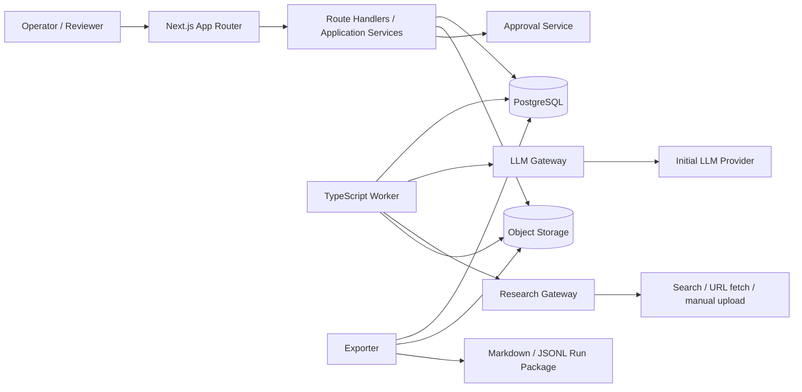
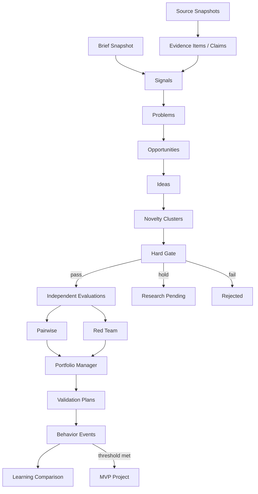

# ARCHITECTURE.md

## 1. 構成案比較

### 案A: 単一同期オーケストレーター + ファイル

```text
CLI/Next.js request -> orchestrator -> LLM/search -> JSONL files
```

| 観点 | 評価 |
|---|---|
| 実装速度 | 最速 |
| 複雑性 | 低い |
| 再現性 | manifestを丁寧に作れば可能 |
| 拡張性 | 低い。長時間処理・並列化・UI更新に弱い |
| コスト | 最小 |
| 障害復旧 | ステップ粒度の手作りcheckpointが必要 |
| 一人開発 | 初期PoCには良いがMVP受け入れ条件を満たしにくい |

不採用理由: Web UI、Resume、監査、複数評価、承認、コスト停止を加えると、ファイルロックと独自状態管理が逆に複雑になる。

### 案B: モジュラーモノリス + PostgreSQLジョブ + 単一ワーカー

```text
Next.js Web/API -> PostgreSQL <- TypeScript Worker -> LLM/Search/Storage
```

| 観点 | 評価 |
|---|---|
| 実装速度 | 速い |
| 複雑性 | 中。境界はモジュールで管理 |
| 再現性 | 高い。入力・出力・snapshot・callをDBに保存 |
| 拡張性 | 中〜高。worker水平追加が可能 |
| コスト | 低〜中。Redis/Kafka不要 |
| 障害復旧 | lease、attempt、artifact hashで実装可能 |
| 一人開発 | 最も相性が良い |

採用。

### 案C: イベント駆動マルチエージェント + Workflow Engine

```text
API -> Temporal/Event Bus -> per-stage services -> data lake/vector DB
```

| 観点 | 評価 |
|---|---|
| 実装速度 | 遅い |
| 複雑性 | 高い |
| 再現性 | 適切に実装すれば最高 |
| 拡張性 | 高い |
| コスト | 高い |
| 障害復旧 | Workflow engineが強い |
| 一人開発 | 不向き |

将来条件: 同時Run 50以上、日次10万job、複数チームが独立デプロイを必要とする場合に再検討する。

## 2. 採用構成

### 2.1 論理構成



### 2.2 デプロイ単位

1. `apps/web`: Next.js。画面、Route Handlers、認証、軽い同期処理。
2. `apps/worker`: Node.js/TypeScript。長時間stage jobを実行。
3. `packages/domain`: entity、state transition、gate rule。
4. `packages/application`: use case、transaction boundary。
5. `packages/llm`: provider adapter、structured output、retry。
6. `packages/evidence`: fetch、snapshot、claim validation。
7. `packages/evaluation`: gate、scoring、pairwise、Red Team。
8. `packages/schemas`: Zod + JSON Schema。
9. `packages/db`: query/repository、migration。
10. `packages/export`: run directory生成。

`page.tsx`は薄いシェルにし、業務ロジックはRoute Handler経由のapplication serviceへ寄せる。Server ActionsはMVPでは使用しない。

## 3. データの正

- **唯一の正**: PostgreSQLのentity、status event、artifact、model call、cost ledger。
- **原文保管**: Object Storage。PDF/HTML/text、source snapshot、LLM raw response。
- **派生出力**: JSONL/Markdown export。DBから再生成可能。
- **検索**: PostgreSQL full-text + `pgvector`。専用vector DBは使わない。

JSONLファイルを正にしない理由は、同時更新、RLS、検索、参照整合性、Resume、監査でDBの方が単純だからである。

## 4. RunとStage

### 4.1 Run

```ts
type RunStatus =
  | 'draft'
  | 'queued'
  | 'running'
  | 'paused'
  | 'budget_paused'
  | 'awaiting_approval'
  | 'completed'
  | 'failed'
  | 'cancelled';
```

Run開始時に次をimmutable snapshotにする。

- brief
- constraints
- rubric
- prompt versions
- agent versions
- model policy
- search query set
- budget policy
- source allow/deny policy

### 4.2 Stage

```ts
type StageStatus =
  | 'pending'
  | 'ready'
  | 'running'
  | 'needs_review'
  | 'passed'
  | 'blocked'
  | 'failed'
  | 'skipped';
```

StageはDAGだが、MVPの標準pipelineは直列中心とする。Evidence reviewや複数Evaluatorだけfan-outする。

## 5. Job管理

### 5.1 Job record

```ts
interface PipelineJob {
  id: string;
  runId: string;
  stageKey: string;
  entityId?: string;
  handlerVersion: string;
  inputHash: string;
  idempotencyKey: string;
  status: 'queued' | 'running' | 'succeeded' | 'failed' | 'dead' | 'cancelled';
  attempt: number;
  maxAttempts: number;
  availableAt: string;
  lockedBy?: string;
  lockedUntil?: string;
  lastErrorCode?: string;
  estimatedMaxCost: number;
}
```

### 5.2 Claimアルゴリズム

WorkerはPostgreSQLで次を実行する。

```sql
SELECT id
FROM pipeline_jobs
WHERE status = 'queued'
  AND available_at <= now()
ORDER BY priority DESC, created_at
FOR UPDATE SKIP LOCKED
LIMIT 1;
```

同じtransactionで`running`, `locked_by`, `locked_until`を設定する。Heartbeatでleaseを延長する。Workerが死んだ場合、reaperが期限切れjobを`queued`へ戻す。

### 5.3 冪等性

- `idempotency_key = sha256(run_id + stage + entity_id + handler_version + input_hash)`
- `pipeline_jobs.idempotency_key`にunique制約。
- Artifact書き込みは`(run_id, artifact_type, logical_key, content_hash)`で重複排除。
- Job完了transactionでartifact、cost、stage progressを同時確定。
- 外部LLM callは`model_calls.request_hash`で再利用可能。ただしtemperature>0の再現試行は別callとして残す。

### 5.4 Retry

| error class | retry | 方針 |
|---|---:|---|
| timeout / 429 / 5xx | 最大3 | exponential backoff + jitter |
| schema_invalid | 最大2 | repair prompt。失敗後needs_review |
| source_not_found | 0 | evidence unresolvedへ |
| auth / forbidden | 0 | blocked + operator action |
| budget_exceeded | 0 | budget_paused |
| prompt_injection_detected | 0 | quarantine + review |
| invariant_violation | 0 | dead + incident log |

## 6. Stageデータフロー



## 7. LLM Gateway

### 7.1 Interface

```ts
interface LLMProvider {
  generateStructured<T>(request: {
    modelPolicyKey: string;
    systemPrompt: string;
    userPayload: unknown;
    outputSchema: JsonSchema;
    temperature: number;
    seed?: number;
    maxOutputTokens: number;
    metadata: Record<string, string>;
  }): Promise<LLMResult<T>>;
}
```

Gateway責務:

- provider-specific request変換
- JSON schema response
- timeout/retry
- token/cost normalization
- raw request/responseの暗号化保管
- input/output hash
- prompt version link
- PII/redaction check
- budget pre-authorization

Gatewayが担わないもの:

- 事業ルール
- Evidenceの真偽決定
- Human approvalの代替
- 自動プロバイダー選択（MVP外）

### 7.2 Context isolation

- Source本文は`UNTRUSTED_SOURCE_CONTENT`としてJSONフィールドに入れる。
- Source内の命令は実行しないとsystem promptで固定する。
- Generatorは未検証Source全文へ直接アクセスせず、承認済Evidenceを使う。
- Evaluatorはgenerator prompt、生成元、過去scoreを受け取らない。
- Red Team KillerとImproverは互いの出力を先に見ない。

## 8. Research Gateway

MVPでは次の3モードに限定する。

1. `url_fetch`: 人間が登録したURLを取得。
2. `search_result_import`: 承認済み検索結果のURL・snippetを登録し、原文を別途fetch。
3. `file_upload`: PDF/HTML/CSVを手動取り込み。

全国クローラー、ログイン突破、robots無視、利用規約に反する取得は行わない。

## 9. Evidence処理

1. Source metadata検証。
2. Snapshot保存とhash。
3. Text抽出。抽出不能ページはpage image reviewへ。
4. Claim候補抽出。
5. locator（page/line/section/quote hash）生成。
6. Claim typeと数値属性検査。
7. support/refute link作成。
8. 信頼度・鮮度・矛盾状態を算出。
9. 低信頼をhuman reviewへ。

FACTの確定はLLMの自己申告でなく、schema rule + source existence + locator + reviewer policyで行う。

## 10. Cost管理

### 10.1 予算階層

- Run total
- Stage
- Agent
- Model
- Idea / Opportunity
- Retry reserve

### 10.2 Preflight

Job開始前に次を確認する。

```text
spent + committed + estimated_job_max <= hard_limit
```

90%でwarning、95%で高価モデルの新規探索を停止、100%到達前に`budget_paused`へする。

### 10.3 Early stop

- Hard Gate fail案へ評価callを発行しない。
- 近似cluster内で代表案以外は詳細Business Model callを省略可能。
- Evidence Coverageが閾値未満ならIdea expansionよりResearch taskを優先。
- 3回連続schema failureでそのagent versionをrun内停止。

## 11. Resume

Resumeは`STATE.md`ではなくDB stateを正として行う。

1. Runのsnapshot hashを確認。
2. `succeeded` jobとartifact hashを検証。
3. lease切れ`running`をrequeue。
4. dependency完了済みの`pending`を`ready`へ。
5. budgetとapprovalを再確認。
6. 未完了jobのみ実行。

Brief、Rubric、Promptを途中で変更した場合は同じRunをResumeせず、`parent_run_id`を持つfork Runを作る。

## 12. Error handling

- Domain errorは安定したerror codeへ変換。
- UIには原因、影響範囲、再試行可否、必要操作を表示。
- Raw provider errorやsecretをUIへ出さない。
- Partial completionを許可し、entity単位でneeds_reviewへ逃がす。
- Stage全体の成功条件は`minimum_success_ratio`と必須artifactで判定。

## 13. Object Storage layout

```text
workspace/{workspace_id}/
  sources/{source_id}/{snapshot_id}/original
  sources/{source_id}/{snapshot_id}/extracted.txt
  model-calls/{call_id}/request.json.enc
  model-calls/{call_id}/response.json.enc
  exports/{run_id}/{export_id}/demand-foundry-run.zip
```

公開URLは発行せず、短時間signed URLのみ。

## 14. 監視

MVPで必要なメトリクス:

- queued/running/dead jobs
- stage duration
- schema failure ratio
- cost per stage / idea
- evidence coverage
- hard gate pass ratio
- evaluator disagreement
- source fetch failure
- approval waiting time
- run resume count

## 15. 将来の拡張境界

以下を満たすまで分散化しない。

- Worker 5台でもqueue latencyがSLO超過
- 1日10万job以上
- チームごとの独立デプロイが必須
- source processingがCPU/GPU専用基盤を必要
- 監査イベントが通常テーブル運用限界を超える

それまではモジュール境界とOutbox Eventで将来移行可能性を残す。
