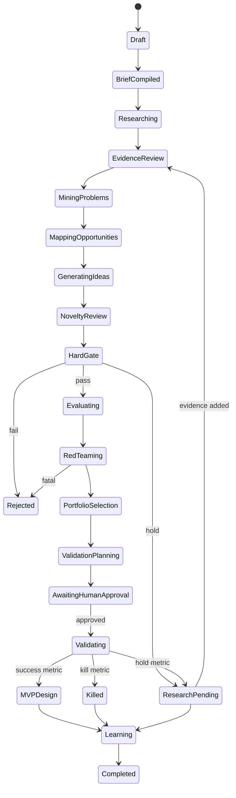

# PIPELINE.md

## 1. Pipeline全体



## 2. Stage共通契約

各Stageは次を持つ。

```yaml
stage_key: evidence_verification
version: 1.0.0
depends_on: [signal_scout]
input_schema: source-snapshot@1.0.0
output_schema: evidence-item@1.0.0
minimum_success_ratio: 0.80
required_artifacts: [evidence.jsonl]
max_attempts: 3
budget_limit: 8.00
human_review_policy: low_confidence_or_conflict
```

### Stage完了条件

- 必須artifactが存在する。
- schema valid率が閾値以上。
- fatal invariant violationがない。
- cost ledgerが確定済み。
- stage output hashが保存済み。

## 3. Stage 0 — Brief Compiler

**入力**: 自由記述、探索対象、地域、予算、期間、資産、除外、risk appetite。  
**出力**: `brief.snapshot.yaml`, `constraints.json`, `rubric.snapshot.yaml`, `search_queries.json`。

### 通過条件

- 地域、顧客優先、MVP期間、開発人数、禁止領域が設定済み。
- Hard Gate閾値と評価ウェイトが合計100。
- Run budget > 0。

### 失格/保留

- 法令違反を目的とする探索: fail。
- 予算・期間が空: holdしdefault案を提示。

### 再実行

Brief確定前のみ同一Runで再実行可能。確定後の変更はfork Run。

## 4. Stage 1 — Signal Scout

**入力**: Brief snapshot、query set。  
**出力**: `sources candidates`, `signals candidates`。

### Signal card必須field

- change type
- observed date / effective date
- geography / industry
- changed from / changed to
- potentially affected actor
- source candidate IDs
- uncertainty

### 通過条件

- サービス案を含まない。
- source candidateがある。
- 同一changeの重複がcluster化される。

### 停止条件

- 50〜100 verified候補、query budget、重複飽和のいずれか。

## 5. Stage 2 — Evidence Verifier

**入力**: Source candidates / claim candidates。  
**出力**: `sources.jsonl`, `evidence.jsonl`, `claims.jsonl`。

### 通過条件

- Source存在、publisher、date、snapshot hashが確認済み。
- Evidenceにlocatorがある。
- FACT候補はsupport linkを持つ。
- 数字にunit/date/region/denominatorまたはformula。

### 保留

- PDF抽出不良、ページ不明、publisher不明、source更新済みでsnapshotなし。

### 失格

- 存在しないURL、引用不一致、AI生成文章のみを根拠にしたclaim。

## 6. Stage 3 — Problem Miner

**入力**: verified signals/evidence。  
**出力**: `problems.jsonl`。

### 通過条件

- actor、trigger、task、failure、frequency、current workflow、cost/unknown、root cause、evidence refs。
- 「社会課題が大きい」だけでない。

### 保留

- 現在の対処や担当者が不明。

## 7. Stage 4 — Opportunity Mapper

**入力**: Problem cards。  
**出力**: `opportunities.jsonl`。

### 標準表現

```text
現在はAという方法で、B円・B時間・B人を使っている判断/作業を、
Cというデータ・技術・取引構造により、Dまで改善する。
```

BまたはDが不明ならUNKNOWN/HYPOTHESISとし、調査taskを付ける。

### 通過条件

- user / payer / decision maker / budget source / current alternative。
- purchase trigger、blocker、why now、initial wedge。

### 保留

payer仮説はあるが予算科目の証拠がない。

### 失格

payer仮説自体が成立せず、受益者と支払者の接続もない。

## 8. Stage 5 — Service Generator

**入力**: Opportunities、generation method matrix、Novelty Archive。  
**出力**: `ideas.jsonl`。

### 生成割当

各Opportunityに対し、少なくとも4つの異なる構造を割り当てる。例:

- automate
- decision support
- monitor/predict
- aggregate/procure
- standardize/API
- outcome pricing
- expert augmentation
- preemption

### 通過条件

- Run全体で20件以上。
- required Idea schemaを満たす。
- sourceにない数字をFACTにしない。

### 再実行

Novelty clusterの新規差分率が20%未満になったら追加生成を停止。

## 9. Stage 6 — Business Model Engineer

**入力**: Ideas。  
**出力**: pricing/economics補完。

### 通過条件

- pricing unit、buyer budget、gross margin assumption。
- 10/100/1000 customers revenue。
- bottom-up formula、low/base/high。
- CAC/LTV/paybackは未検証と表示。

### 失格

売上単価より必須の個別運用費が恒常的に高い構造。

## 10. Stage 7 — Hard Gate

順序は固定。最初のfatal failで打ち切ってよいが、監査のため全gateを評価する設定も可能。

### 結果

- `pass`: Independent Evaluationへ。
- `hold`: `evidence_required`付きでresearch queueへ。
- `fail`: rejected。人間がoverrideする場合は理由と承認を必須。

### Gate再実行

Ideaのrelevant fieldまたはEvidenceが変わった場合のみ。`input_hash`が同じなら結果再利用。

## 11. Stage 8 — Independent Evaluation

**入力**: pass ideasのblinded packets。  
**出力**: `evaluations.jsonl`。

### Fan-out

- Evidence Referee
- Commercial Referee
- Technical Referee

必要に応じて4人目のStrategic Refereeを加えるがMVP必須ではない。

### 通過条件

- 3評価完了。
- score理由とconfidence。
- evaluator identityとprompt version。
- disagreement flag。

### 再評価

Evidence追加、Idea materially revised、Rubric version変更時のみ。

## 12. Stage 9 — Red Team

**入力**: 上位5〜8案。  
**出力**: `red-team.jsonl`, revised ideas / kill recommendation。

### 順序

1. Killerを独立実行。
2. Fatal findingのevidence check。
3. Improverを実行。
4. Material revisionならHard Gateへ戻す。
5. 解消不能fatalならfail。

## 13. Stage 10 — Validation Designer

**入力**: Red Team後の上位3〜5案。  
**出力**: `validation-plans.jsonl`。

### 必須

- biggest uncertainty
- target role/org
- contact method
- interview questions
- sales copy
- mock/demo/LP
- price ask
- sample size
- duration <= 30 days
- cost
- success / hold / kill
- human approvals required

### 通過条件

少なくとも1つの行動証拠を成功条件に含む。好意的回答だけを成功にしない。

## 14. Stage 11 — MVP Architect

**開始条件**: Validation success thresholdを満たし、humanが昇格承認。  
**出力**: MVP scope、acceptance criteria、project record。

### 失格

- 顧客データ提供が取れていないのにデータ依存MVPを作る。
- 価格提示を避けたまま本格実装へ進む。
- value momentが定義できない。

## 15. Stage 12 — Portfolio Manager

### 標準ファネル

| 段階 | 目安 |
|---|---:|
| Signals | 500〜1,000（長期運用） |
| Problems | 100〜200 |
| Opportunities | 30〜50 |
| Detailed ideas | 10〜20 |
| Customer validation | 3〜5 |
| Paid pilots | 1〜2 |
| Full build | 0〜1 |

MVP 1RunではSignals 50〜100、Problems 10〜30、Opportunities 5〜15、Ideas 20以上を現実的な目安とする。

### 選定制約

- Fatalなし。
- 同一Novelty clusterから原則1案。
- 検証費用総額<=portfolio budget。
- 少なくとも1案は30日以内に金銭またはデータ提供を問える。
- 最大不確実性が異なる案を優先。

## 16. Stage 13 — Learning Engine

**入力**: predictions、behavior events、validation cost/time、actual build data。  
**出力**: calibration report、rule change proposal、updated rubric candidate。

### 状態イベント

```text
generated -> rejected | research_pending | interview_requested
interview_requested -> interview_completed | killed
interview_completed -> internal_referral | data_shared | LOI_received | killed
LOI_received -> paid_pilot | killed
paid_pilot -> converted | churned
converted -> retained | expanded | churned
* -> killed
```

状態を上書きせず`idea_status_events`へappendする。現在状態はprojection。

### 更新制約

- n<30: 記述統計と定性findingのみ。
- 30<=n<100: calibration proposal。自動適用なし。
- n>=100: simple calibration modelをshadow運用可能。
- Rubric変更はhuman approval + version bump + backtest必須。

## 17. Pause / Resume / Fork

- Pause: 新規job claimを止め、実行中jobは安全地点まで完了。
- Resume: snapshot不変なら未完jobのみ再開。
- Retry: 同一handler/inputでattempt追加。
- Fork: Brief/Rubric/Prompt/Source policy変更時にparent_run_id付き新Run。
- Cancel: queued jobをcancel、完了artifactは保持。

## 18. Run completion

Runは次の条件を満たしたとき`completed`になる。

- required stagesがpassed/skipped。
- 上位案のdecisionが確定。
- unresolved fatal errorなし。
- cost ledger確定。
- export manifestが生成可能。
- validation未実施の場合は`research_complete`として別completion typeを付ける。
