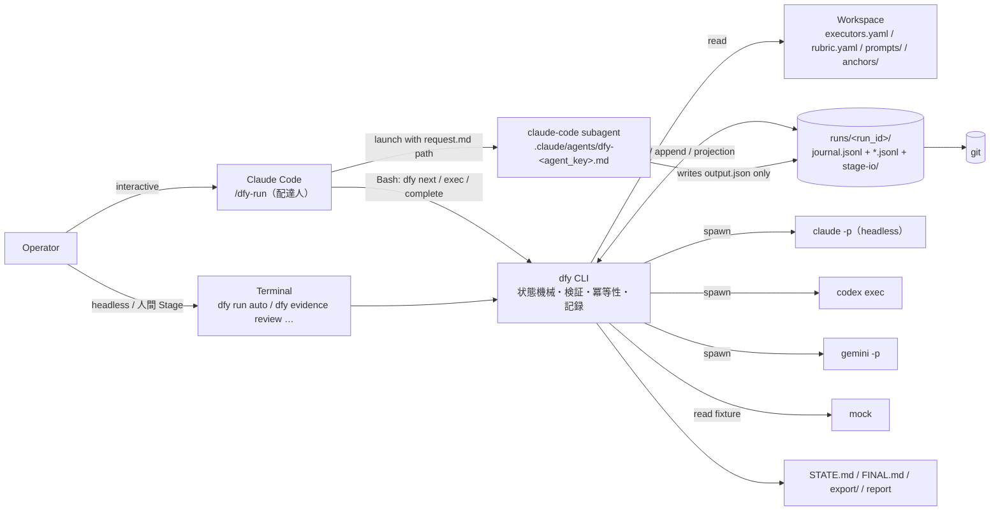
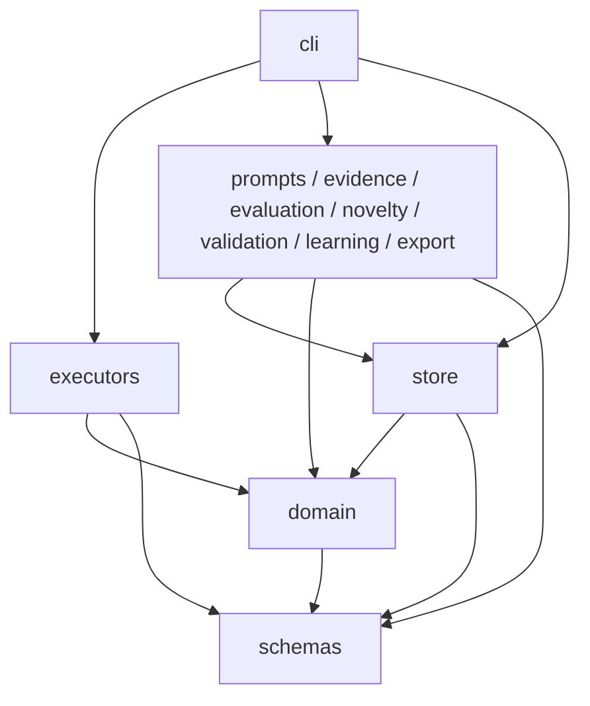
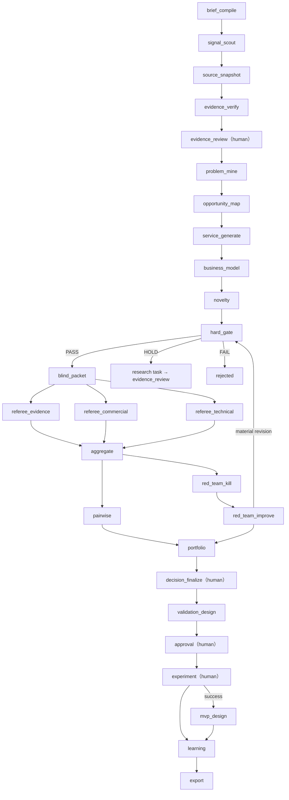

# ARCHITECTURE.md

設計版: design-v2.0.0 / 所有範囲: 構成案比較、採用構成、モジュール境界、データフロー、Journal と Projection、lease・冪等性・retry、Resume/Fork、容量管理、監視、Phase 2/3 の拡張境界

語彙・ID・ファイル配置・状態名・コマンド名は `docs/CONTRACTS.md` に従う。本書はそれらを再定義しない。

## 1. 構成案比較

| 観点 | 案A: Web + PostgreSQL + Worker（v1 採用構成） | 案B: ローカル優先 `dfy` CLI + run ディレクトリ + フェーズ別 executor | 案C: IdeaForge 型 slash command + Markdown のみ |
|---|---|---|---|
| 形 | Next.js Route Handler → PostgreSQL ← TypeScript Worker → LLM API | Operator → `/dfy-run` または terminal → `dfy` CLI → `runs/<run_id>/` ← executors | Claude Code の `/ideate` 相当がサブエージェントを起動し、Markdown を読み書き |
| 実装速度 | 遅い。Auth、RLS、migration、Worker、UI を同時に作る | 速い。単一 package、DB なし、UI は Markdown | 最速。コードはほぼ prompt |
| 複雑性 | 中〜高。デプロイ単位 2 + packages 8 | 低〜中。プロセス 1、ファイル I/O のみ | 低いが、手順遵守が LLM 依存で確率的 |
| 再現性 | 高い（DB に snapshot・call を保存） | 高い。snapshot + journal hash chain + `dfy verify` | 低い。schema 無し、入出力 hash 無し、呼び出し記録無し |
| 証拠システム | Source/Evidence/Claim を DB で表現 | 同じ型を JSONL で表現。FACT 不変条件は `dfy complete` が検査 | 無い。auditor の裏取りに依存 |
| LLM の選択 | 1 API プロバイダー（API key、従量課金） | Claude Code / Codex / Gemini CLI をサブスクリプションで、Stage ごとに割当。ベンダー分散が可能 | Claude Code 固定 |
| 金銭コスト | ホスティング + DB + API 従量 | サブスクリプションのみ（USD は cost table 設定時に推計） | サブスクリプションのみ |
| 障害復旧 | lease + reaper + transaction | journal + lease + idempotency_key。`dfy run resume` が未完了 Job のみ再開 | `STATE.md` を人が読んで再開 |
| 監査 | append-only audit_logs | append-only journal（hash chain）+ git | 無い |
| マルチユーザー | Supabase Auth + RLS | 単一運営者。Phase 3 で DB import | 無い |
| 一人開発 | 12 週では広すぎる（v1 Red Team 指摘） | 最も相性が良い | 良いが MVP 受け入れ条件を満たさない |

- **案A 不採用理由**: 単一運営者・ローカル実行では Auth/RLS/ホスティング/Worker が純粋なオーバーヘッドである。API key 前提のためサブスクリプション利用枠を活かせず、Claude Code 内でサブエージェントを使う運用に接続できない。再検討条件は §11.3。
- **案B 採用**: 「決定的処理はスクリプト、オーケストレーターは配達人」という IdeaForge v3.1 の分離を、状態機械・schema 検証・証拠・journal・executor 抽象で拡張する。v1 の核は全て維持する。
- **案C 不採用理由**: schema・証拠・記録が無く、Claude 固定で、オーケストレーターが LLM のため手順遵守が確率的（IdeaForge v1 で越権 2 回、監査が最後尾にしか無く誤った数字が最終ラウンドまで残存）。IdeaForge から借りるのは役割分離・ブラインド化・アンカー・ペア比較・2 回監査・Courier Rule であり、実行基盤は借りない。

## 2. 採用構成

### 2.1 論理構成



実行形態（interactive / headless / mock）と各形態での executor 起動主体は `CONTRACTS.md §4` の通り。どの形態でも状態機械・検証・冪等性・記録は `dfy` CLI だけが持つ。

### 2.2 責務分担

| 主体 | してよいこと | してはならないこと |
|---|---|---|
| Operator（人間） | Run 操作、human Stage、override、fork | projection・journal の手編集 |
| Orchestrator `/dfy-run` | `dfy next` の出力（パス・ID）を無改変で渡す、`dfy exec` / `dfy complete` を Bash 実行、`dfy` の出力を報告 | 要約・判断・採点姿勢の指示・判定の上書き・状態ファイルへの書込（Courier Rule。`docs/ORCHESTRATION.md`） |
| `dfy` CLI | 状態遷移、Request 描画、lease、schema 検証と修復依頼、不変条件検査、journal/JSONL 追記、projection、容量・予算判定、export | 内容の生成 |
| Executor（子プロセス / subagent） | `request.*` を読み、`output_path` に JSON を書く（subagent）か stdout に返す（headless） | `output_path` 以外への書込、`tool_policy.read_paths` 以外の読取、外部行為 |
| git | 履歴・差分・バックアップ（`stage-io/` と `snapshots/` は除外） | 状態の正であること（journal が正、git は複製） |

### 2.3 不変条件「CLI が状態を所有する」

`dfy verify` とテストで検査する。違反は `INVARIANT_VIOLATION`。

| # | 不変条件 |
|---|---|
| INV-1 | run directory の JSONL・journal・projection・packets・pairs・export を書くプロセスは `dfy` CLI のみ。例外は executor が書く `stage-io/<stage_key>/<job_id>/output.json` だけで、これは「未検証の出力」であり `dfy complete` を通るまで状態ではない |
| INV-2 | `journal.jsonl` は append-only。`seq` は 1 から単調増加、`hash = sha256(prev_hash + canonical(record without hash))` |
| INV-3 | `STATE.md` / `costs.json` / `FINAL.md` / `manifest.json` の一部は journal + JSONL から機械的に再計算できる。再計算結果と一致しなければ警告 |
| INV-4 | Run / Stage / Job の状態遷移は `src/domain` の遷移表のみを通る。遷移表に無い遷移は `INVALID_STATE_TRANSITION`（終了コード 3） |
| INV-5 | Snapshot（brief / rubric / executors / prompts / anchors / constraints）は `dfy run new` で固定され、以後変更しない。変更は `dfy run fork` |
| INV-6 | LLM 出力は schema 検証・不変条件検査（FACT の `evidence_ids`、数値属性、packet leak、generator≠evaluator）を通過するまでエンティティ JSONL に入らない |
| INV-7 | 人間操作の journal レコードは `actor.type=human`、`--by <name>`、`reason` を必ず持つ |
| INV-8 | `src/executors` は `src/store` を import しない。executor は「Request を受け取り raw 出力・usage・model を返す」プロセスアダプタである |

## 3. モジュール境界と依存方向

配置は `CONTRACTS.md §5.1`。依存は下方向のみ。循環禁止。`tests/` に import 境界テストを置く。



| 層 | モジュール | 責務 | 外部 I/O |
|---|---|---|---|
| 0 | `schemas`、`domain` | Zod 定義と JSON Schema 生成。ID 採番規則、`content_hash` / `idempotency_key`、状態遷移表、不変条件、Stage DAG の型 | なし（純関数） |
| 1 | `store` | run directory の読取・追記、`.lock`、journal（chain 計算・検証）、projection 再計算、fixture 読込互換 | ファイル |
| 2 | `executors` | 4 executor のアダプタ。起動引数、終了コード正規化、usage 抽出、利用枠エラー検知 | 子プロセス・fixture。**store 不可** |
| 2 | `prompts`、`evidence`、`evaluation`、`novelty`、`validation`、`learning`、`export` | `CONTRACTS.md §5.1` の通り（Request 描画と `.claude/agents/` 生成は `prompts`） | `evidence` のみネットワーク。書込は store 経由 |
| 3 | `cli` | コマンド定義、引数検証、コマンドごとの手順（`CONTRACTS.md §9.3` の固定手順を含む）、終了コード | 上記全て |

規則:

- 層 2 のモジュールは `WriteSet`（追記するエンティティ行 + journal payload）を返し、**コミットは `cli` が `store.commit()` で行う**。層 2 が直接 `fs` を呼ぶのは外部 I/O（ネットワーク、子プロセス、fixture）だけである。
- `executors` の契約は 1 つ: `run(request: StageRequest, ctx): Promise<ExecutorRawResult>`（raw text、`usage`、`model_reported`、`session_id`、終了コード、正規化 error code）。subagent モードでは `run()` を呼ばず、`dfy next` が描画し `dfy complete` が `output_path` を読む。詳細は `docs/EXECUTORS.md`。
- Stage 固有のロジック（Gate 規則、集計式、portfolio 制約）は `evaluation` 等に置き、`cli` はそれを呼ぶだけにする。数式の正本は `docs/EVALUATION.md`。

## 4. データの正

- **唯一の正**: `runs/<run_id>/` の journal とエンティティ JSONL（`CONTRACTS.md §5.3`）。
- **原文保管**: `snapshots/<source_id>/<content_hash>/`（Source 原文・抽出テキスト）と `stage-io/`（LLM raw 出力・request・repairs）。git 対象外。export には hash のみ含める。
- **派生出力**: `STATE.md`、`costs.json`、`FINAL.md`、`export/`、`dfy report`。全て再生成可能。
- **検索**: `dfy show --json` と `jq`/`grep`。全文検索・embedding は MVP に無い。

v1 は「同時更新、RLS、検索、参照整合性、Resume、監査は DB の方が単純」として DB を正にした。v2 はそれぞれを次で置き換える: 同時更新 → `.lock`（単一運営者）、RLS → ファイル権限 + git（`docs/SECURITY_AND_RISK.md`）、検索 → `dfy show`、参照整合性 → `dfy verify`（ID 参照の存在検査）、Resume → journal、監査 → hash chain。単一運営者という前提が崩れたときが Phase 3 の条件である（§11.3）。

### 4.1 Journal と Projection

コミット単位（`store.commit()`）は `.lock` 保持中に次の順で行う。

1. journal に状態レコードを追記（`job.succeeded` 等。`fsync`）。
2. エンティティ JSONL に行を追記（`content_hash` が既存なら追記しない）。
3. journal に `entity.written`（file、追記行数、行の `content_hash` 一覧）を追記。
4. projection（`STATE.md`、`costs.json`）を再生成。

途中で落ちた場合の復旧規則: `dfy run resume` / `dfy next` の冒頭で、`job.succeeded` に対応する `entity.written` が無ければ `response.json` から手順 2〜4 を再適用する（`content_hash` 重複はスキップするため冪等）。projection が古いだけなら再生成する。この規則により「journal に無い状態は存在しない」が保たれる。

ID は `id.allocated` で確定する。失敗した Job に採番済みの ID は欠番として残す（再利用しない）。

`.lock` は `{pid, started_at}` を持つ。pid が生存していなければ古い lock として回収し、journal に `note` を残す。生存していれば `LOCK_HELD`（終了コード 8）。

### 4.2 Lease と reaper

- `dfy next` は実行可能 Job を `queued → dispatched` にし、`lease = {dispatched_at, expires_at, holder}` を付与する。TTL は 30 分（`--lease-ttl`）。`holder` は `{type: 'orchestrator'|'cli', pid?}`。
- `dfy exec` は `dispatched → running` にし、`holder.pid` に自プロセスの pid を入れる。
- reaper は `dfy next` と `dfy run resume` の冒頭で動く。(a) `dispatched` で `expires_at < now` → `job.requeued`（reason `lease_expired`）。(b) `running` で `holder.pid` が同一マシンに生存していない → `job.requeued`（reason `holder_dead`）。attempt は dispatch 時に加算し、`max_attempts` 超過で `dead`。
- `dfy complete` は lease が有効な `dispatched`/`running` Job のみ受け付ける。期限切れなら `LEASE_EXPIRED` とし、出力は `output.raw.txt` として保存するが状態は進めない（再 lease 後の complete で `--output` に同じファイルを渡せる）。
- 並列: `dfy next --max N` は executor ごとの `capacity.max_parallel` を超えて lease しない。オーケストレーターの並列起動規則は `docs/ORCHESTRATION.md`。

### 4.3 冪等性

- `idempotency_key = sha256(run_id | stage_key | entity_id | handler_version | input_hash)`。同じ key の Job が `queued / dispatched / running / succeeded` にある間は新しい Job を作らない（`jobs.jsonl` と journal から判定）。
- `dfy complete` を同じ Job に二度呼んだ場合: `output_hash` が同じなら no-op（終了コード 0）、異なれば `IDEMPOTENCY_CONFLICT`。
- Stage 再実行（`dfy requeue --scope failed_only` 等）は `handler_version + input_hash` が同じ成功 Job を作り直さない。Idea revision や Evidence 変更で `input_hash` が変わった Job だけが新規になる。
- エンティティ追記は `content_hash` で重複排除する。Idea revision は `version` を進めた別行であり、`content_hash` も異なる。
- LLM 呼び出しの再利用: 同じ `idempotency_key` の成功 `response.json` があれば新規 call を出さない。temperature/seed を CLI で制御できないため、response cache による「再現試行」は行わない（再現は fixture = mock executor で行う）。

### 4.4 error class 別 retry

| error class | 正規化コード | retry | 方針 |
|---|---|---:|---|
| timeout / 5xx / CLI 異常終了（一時的） | `EXECUTOR_ERROR`（retryable） | 最大 3 attempt | `available_at = now + min(60 × 2^(attempt−1), 900) 秒 + jitter(0〜30 秒)`。超過で `dead` |
| 出力が schema 不適合 | `SCHEMA_INVALID` | repair 最大 2 回（同一 attempt 内） | `repairs/<n>.json` に誤り一覧を付けて再依頼。修復後も不適合なら Job `failed`、Stage `needs_review`（終了コード 7） |
| 利用枠・レート制限 | `QUOTA_LIMIT_REACHED` | attempt を消費しない | Job → `queued`（`available_at = now + cooldown_on_limit_s`）、Run → `quota_paused`。cooldown 後 `dfy run resume` |
| リクエスト数 / USD 推計の上限 | `BUDGET_LIMIT_REACHED` | 0 | call せず Run → `budget_paused`。上限を変えるには `dfy run fork` または brief の budget を変更した新 Run |
| 認証切れ・CLI 不在 | `EXECUTOR_UNAVAILABLE` | 0 | Run → `paused`。`dfy doctor` で原因を表示。人間が再ログイン |
| capability 不足 | `CAPABILITY_MISSING` | 0 | `dfy run start` / `dfy doctor` で拒否（終了コード 6） |
| Source fetch 失敗（404 / terms block） | `NOT_FOUND` | 0 | Source `unavailable`、依存 Evidence は unresolved、Research task を作る |
| 命令文らしき内容の混入 | `PROMPT_INJECTION_SUSPECTED` | 0 | 出力を quarantine（`stage-io/` に残し、エンティティに入れない）、Evidence を flag、Stage `needs_review`。方針は `docs/EVIDENCE.md` / `docs/SECURITY_AND_RISK.md` |
| 不変条件違反（FACT に evidence 無し、packet leak、generator=evaluator 等） | `INVARIANT_VIOLATION` | 0 | Job `dead` + journal `incident` |
| lease 期限切れで complete | `LEASE_EXPIRED` | — | §4.2 |
| lock 競合 | `LOCK_HELD` | 呼び出し側が再試行 | 終了コード 8 |

3 回連続で同じ `agent_key` が `SCHEMA_INVALID` になった場合、当該 Run 内でその Stage を `blocked` にし人間に知らせる（v1 の early stop を継承。詳細は `docs/PIPELINE.md`）。

## 5. Stage データフロー

DAG の正は `docs/PIPELINE.md`。ここでは主流のみ示す。`human` Stage で Run は `awaiting_human` になり、`dfy run auto` は終了コード 10 で止まる。



deterministic Stage（`source_snapshot`、`novelty`、`hard_gate`、`blind_packet`、`aggregate`、`portfolio`、`learning`、`export`）は LLM を呼ばず `dfy` 内で完結する。referee 3 Stage は同じ packet + anchors 2 packet を入力にし、`executors.snapshot.yaml` の割当が `referee_vendor_diversity_min` を満たすことを `dfy run start` が検査する。

## 6. Executor 境界と context isolation

- 起動コマンド・認証・能力・構造化出力・利用枠検知は `docs/EXECUTORS.md`、共通の実行手順は `CONTRACTS.md §9.3`。`dfy complete` は executor 側の構造化出力を信用せず必ず再検証する。
- Source 本文は `request.json.untrusted_content` に隔離する。Generator は approved Evidence のみを受け取り（v1 D-022 維持）、Referee は title・origin・rank・他 referee の出力を受け取らず（packet leak validator）、Red Team Killer と Improver は互いの出力を先に見ない。
- tool policy は Stage の `capabilities_required` から描画し、tool 不要 Stage は完全無効化する。

## 7. Resume / Fork

### 7.1 Resume（`dfy run resume <run_id>`）

1. `.lock` を取得する。
2. snapshot ファイルの hash を `run.created` の payload と照合する。不一致なら `FORK_REQUIRED`（何も変更しない）。
3. journal の hash chain を検証する。破損なら `VERIFY_FAILED`（終了コード 9）で停止。
4. §4.1 の復旧規則（`job.succeeded` あり `entity.written` なし）を適用する。
5. reaper（§4.2）を実行する。
6. projection（Stage 状態、Job 状態）を journal から再計算する。
7. 依存 Stage が `passed`/`skipped` の `pending` Stage を `ready` にする。
8. 容量・利用枠・予算を再確認する。`quota_paused` は cooldown 経過後のみ `running` へ。`budget_paused` は上限変更なしには再開しない。
9. 未完了 Job（`queued`、requeue 済み）のみを実行対象にする。**`succeeded` Job は再実行しない**（v1 AC-08 を継承）。
10. Run を `running` にする。次の Stage が `human` なら `awaiting_human`。

`/dfy-run <run_id>` は最初に `dfy run resume` を呼び、以降 `dfy next` の出力に従う。Resume で `STATE.md` を読まない（projection は結果であって入力ではない）。

### 7.2 Fork（`dfy run fork <run_id>`）

- Brief / Rubric / Prompt / executors / anchors のいずれかを変えたい場合は同じ Run を再開せず、`parent_run_id` 付きの新 Run を `draft` で作る。journal 先頭の `run.created` に `parent_run_id` と差分（変更した snapshot の hash）を記録する。
- 既定ではエンティティを引き継がない。指定した Stage までのエンティティ JSONL を複製する場合、複製元の `run_id` と `content_hash` を journal の `note` に残す（provenance）。引数は `docs/CLI_SPEC.md`。
- Run 途中で `executors.yaml` を変えても当該 Run には反映しない（`executors.snapshot.yaml` が正）。

## 8. 容量・利用枠・予算

語彙は `CONTRACTS.md §14`。早期停止規則（Gate FAIL 案に評価 call を出さない等）は `docs/PIPELINE.md`。

### 8.1 Preflight

`dfy next` が Job を lease する前、`dfy exec` が子プロセスを起動する前に次を判定する。

```text
requests_used[executor] + in_flight[executor] < capacity.max_requests_per_run[executor]
AND requests_used[stage]  < budget.requests.stage[stage_key]
AND requests_used[run]    < budget.requests.run
AND (budget.usd 未設定 OR usd_estimated + usd_committed < budget.usd)
AND run.status ∉ {quota_paused, budget_paused, paused}
```

判定値は `request.json.capacity_remaining` に描画し、subagent にも見せる（ただし subagent は判断しない）。90% で `STATE.md` に警告、100% 到達前に `budget_paused`。

### 8.2 `quota_paused` と `budget_paused`

| | `quota_paused` | `budget_paused` |
|---|---|---|
| 原因 | executor CLI の利用枠・レート制限エラー（5 時間枠、日次上限等） | `budget.requests` または `budget.usd` の上限到達 |
| 検知 | 各 CLI の終了コード・メッセージを `QUOTA_LIMIT_REACHED` に正規化（`docs/EXECUTORS.md`） | preflight（call 前） |
| Job | `queued` へ戻す（`available_at = now + cooldown`）。attempt 消費なし | 起動しない |
| 復帰 | cooldown 後 `dfy run resume`（`dfy run auto` の自動待機オプションは `docs/CLI_SPEC.md`） | 上限変更（fork または新 Run） |
| journal | `run.status`（reason `quota`、executor 名、cooldown） | `run.status`（reason `budget`、scope、上限値） |

### 8.3 usage と USD

- subagent モードは usage を取れない（`usage.known=false`、`requests=1`）。`policies.usage_unknown_policy: count_requests` により予算はリクエスト数で管理する。
- headless（`claude -p` json、`codex --json`、`gemini --output-format json`）は token を記録する。USD 推計は cost table を設定した executor だけに付け、`costs.json` に `requests` / `tokens` / `usd_estimated`（null 可）を分けて出す。USD を primary にしない。
- 利用枠の数値（日次リクエスト上限等）は変更され得るため、設計に固定値として書かない。`dfy doctor` が現在の設定と直近の `QUOTA_LIMIT_REACHED` 回数を表示する。

## 9. 監視メトリクス

全て journal / `jobs.jsonl` / `model-calls.jsonl` / エンティティ JSONL から計算し、`dfy run status` と `STATE.md` に出す（Phase 2 で `dfy report` にも）。

| 区分 | メトリクス | 出所 |
|---|---|---|
| 実行基盤 | queued / dispatched / running / dead Job 数、lease 失効・requeue・resume 回数、Stage 所要時間、`dfy verify` 失敗件数 | journal |
| executor | schema repair 率（executor × agent_key）、requests と capacity 残（executor / Stage 別）、`QUOTA_LIMIT_REACHED` 回数と cooldown 累計、usage unknown 率 | `model-calls.jsonl`、journal |
| 証拠 | Evidence coverage、FACT の evidence 付与率、Source fetch 失敗率、injection flag 件数 | `claims.jsonl`、`evidence.jsonl`、`sources.jsonl` |
| 評価 | Gate PASS/HOLD/FAIL 比率と override 数、referee disagreement 件数、anchor gap（STRONG − WEAK）の referee run 別推移、実際に使われた referee executor の種類数 | `gates.jsonl`、`evaluations.jsonl`、`executors.snapshot.yaml` |
| 人間 | approval 待ち日数、未接触日数 | `approvals.jsonl`、`experiments/` |

## 10. エラー処理の標準

- ドメインエラーは `CONTRACTS.md §12.2` の安定コードに変換し、`--json` では `{error: {code, message, details, retryable, action}}` を返す。
- 端末表示は「原因 / 影響範囲 / 再試行可否 / 次の操作」の 4 行を必ず含む（`docs/UI_UX.md`）。executor の raw エラーと資格情報は表示しない（`stage-io/` の `output.raw.txt` に残す）。
- Partial completion を許可し、entity 単位で `needs_review` へ逃がす。Stage 全体の成功条件は `minimum_success_ratio` と必須 artifact で判定する（`docs/PIPELINE.md`）。

## 11. 拡張境界

### 11.1 Phase 1（MVP、本設計）

`dfy` CLI、run directory、4 executor、human Stage の CLI 操作、`/dfy-run` と `/dfy-review`、`dfy export` / `dfy verify`、mock executor による v1 サンプル run の再現。Web も DB も無い。

### 11.2 Phase 2: `dfy report` → 読み取り専用 viewer

- 第一段は `dfy report`（P1）: run directory から静的 HTML を生成する。入力は projection と JSONL のみ、出力は `export/` 配下。
- 第二段は読み取り専用 viewer: ローカルで run directory を読むだけのプロセス。**書込は一切しない**（INV-1 を維持）。レビュー操作は引き続き `dfy evidence review` 等の CLI か `/dfy-review` で行う。
- 開始条件: 1 Run あたりの Evidence review が端末で回らない（目安: proposed Evidence が 50 件超）、または運営者以外の閲覧者（Domain Reviewer、投資家）が現れたとき。
- 禁止: viewer からの書込 API。書きたくなった時点で Phase 3 の条件（§11.3）を検討する。

### 11.3 Phase 3: PostgreSQL import・マルチユーザー

- 方式: `journal.jsonl` → 監査テーブル、エンティティ JSONL → v1 `DATA_MODEL.md` のテーブル、`model-calls.jsonl` → `model_calls`、として **一方向 import** する。run directory は import 後も正であり続け、DB を正に切り替える（cut-over）判断は別の ADR にする。必要な前提は `docs/CHANGES_FROM_V1.md §7`。
- 再検討条件（いずれか）: (a) 2 人以上が同時に書く、(b) 複数マシンで同じ Run を進める、(c) 同時 Run が 5 を超える、(d) 外部監査人や顧客に RLS 付きの閲覧を提供する、(e) embedding / 全文検索を Novelty に必要とする、(f) Run 総数が 100 を超え projection 再計算が運用上遅い。
- それまでは `schema_version`、run 内一意 ID、journal `seq` と hash chain、`content_hash`、manifest を維持することで移行可能性を保つ。

### 11.4 分散化しない条件

v1 §15 を継承する。Worker 複数台・queue 基盤・独立デプロイは、Phase 3 の DB 化の後で、かつ 1 日 10 万 Job または独立デプロイ要求が現実になるまで検討しない。
